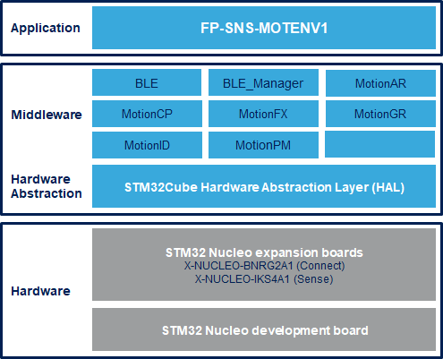

# FP-SNS-MOTENV1 Firmware Package

The FP-SNS-MOTENV1 is an STM32Cube function pack which lets you connect your IoT node to a smartphone via BLE and use a suitable AndroidT or iOST like the ST BLE Sensor app
to view real-time environmental sensor data and motion sensor data.
The package also enables advanced functionality such as sensor data fusion and accelerometer-based real-time activity recognition, carry position, gesture recognition, pedometer, motion Intensity and campass.
This package, together with the suggested combination of STM32 and ST devices can be used to develop specific wearable applications, or smart things applications in general.

The software runs on the STM32 microcontroller and includes all the necessary drivers to recognize the devices on the STM32 Nucleo development board and expansion boards.

The expansion is built on STM32Cube software technology to ease portability across different STM32 microcontrollers.

**FP-SNS-MOTENV1 software features**:

- Complete firmware to develop an IoT node with BLE connectivity, environmental and motion sensors

- For Nucleo-F401RE and Nucleo-L476RG, middleware libraries for sensor data fusion and acelerometer-based real-time activity recognition, carry position, gesture recognition, motion intensity recognition and pedometer.

- Firmware compatible with ST BLE Sensor applications for Android/iOS, to perform sensor data reading, motion algorithm features demo and firmware update (FOTA - For Nucleo-F401RE and Nucleo-L476RG)
(Version 4.20.0/4.20.0 or higher)

- Easy portability across different MCU families, thanks to STM32Cube

- Free, user-friendly license terms

This firmware package includes Components Device Drivers, Board Support Package and example application for the STMicroelectronics:

- NUCLEO-F401RE nucleo development board and expansion boards:
  - X-NUCLEO-BNRG2A1 Bluetooth Low energy expansion boards
  - X-NUCLEO-IKS01A2 Expansion board for four MEMS sensor devices:
       - HTS221, LPS22HB, LSM6DSL, LSM303AGR
  - X-NUCLEO-IKS01A3 Expansion board for four MEMS sensor devices:
       - HTS221, LPS22HH, LSM6DSO, LIS2MDL
  
- NUCLEO-L476RG nucleo development board and expansion boards:
  - X-NUCLEO-BNRG2A1 Bluetooth Low energy expansion boards
  - X-NUCLEO-IKS01A2 Expansion board for four MEMS sensor devices:
       - HTS221, LPS22HB, LSM6DSL, LSM303AGR
  - X-NUCLEO-IKS01A3 Expansion board for four MEMS sensor devices:
       - HTS221, LPS22HH, LSM6DSO, LIS2MDL
  
- NUCLEO-L053R8 nucleo development board and expansion boards:
  - X-NUCLEO-BNRG2A1 Bluetooth Low energy expansion boards
  - X-NUCLEO-IKS01A2 Expansion board for four MEMS sensor devices:
       - HTS221, LPS22HB, LSM6DSL, LSM303AGR
  - X-NUCLEO-IKS01A3 Expansion board for four MEMS sensor devices:
       - HTS221, LPS22HH, LSM6DSO, LIS2MDL

Here is the list of references to user documents:

- [DB2852: STM32Cube function pack for IoT node with BLE connectivity, environmental and motion sensors ](https://www.st.com/resource/en/data_brief/fp-sns-motenv1.pdf)
- [UM2016: Getting started with the STM32Cube function pack for IoT node with BLE connectivity, environmental and motion sensors](https://www.st.com/resource/en/user_manual/um2016-getting-started-with-the-stm32cube-function-pack-for-iot-node-with-ble-connectivity-and-environmental-and-motion-sensors-stmicroelectronics.pdf)
- [FP-SNS-MOTENV1 Quick Start Guide](https://www.st.com/content/ccc/resource/sales_and_marketing/presentation/product_presentation/group0/0f/3f/59/05/d8/9e/4a/03/FP-SNS-MOTENV1%20quick%20start%20guide/files/FP-SNS-MOTENV1_quick_start_guide.pdf/jcr:content/translations/en.FP-SNS-MOTENV1_quick_start_guide.pdf)

## Supported Devices and Boards

- NUCLEO-F401RE STM32 Nucleo-64 development board with STM32F401RE MCU, supports Arduino and ST morpho connectivity \[[NUCLEO-F401RE](https://www.st.com/content/st_com/en/products/evaluation-tools/product-evaluation-tools/mcu-mpu-eval-tools/stm32-mcu-mpu-eval-tools/stm32-nucleo-boards/nucleo-f401re.html)\]
- NUCLEO-L053R8 STM32 Nucleo-64 development board with STM32L476RG MCU, supports Arduino and ST morpho connectivity \[[NUCLEO-L053R8](https://www.st.com/content/st_com/en/products/evaluation-tools/product-evaluation-tools/mcu-mpu-eval-tools/stm32-mcu-mpu-eval-tools/stm32-nucleo-boards/nucleo-l053r8.html)\]
- NUCLEO-L476RG STM32 Nucleo-64 development board with STM32L476RG MCU, supports Arduino and ST morpho connectivity \[[NUCLEO-L476RG](https://www.st.com/content/st_com/en/products/evaluation-tools/product-evaluation-tools/mcu-mpu-eval-tools/stm32-mcu-mpu-eval-tools/stm32-nucleo-boards/nucleo-l476rg.html)\]
- X-NUCLEO-BNRG2A1 Bluetooth Low Energy expansion board based on the BLUENRG-M2SP module for STM32 Nucleo \[[X-NUCLEO-BNRG2A1](https://www.st.com/en/ecosystems/x-nucleo-bnrg2a1.html)]
- X-NUCLEO-IKS01A2 Motion MEMS and environmental sensor expansion board for STM32 Nucleo \[[X-NUCLEO-IKS01A2](https://www.st.com/en/ecosystems/x-nucleo-iks01a2.html)]
- X-NUCLEO-IKS01A3 Motion MEMS and environmental sensor expansion board for STM32 Nucleo \[[X-NUCLEO-IKS01A3](https://www.st.com/en/ecosystems/x-nucleo-iks01a3.html)]

## Known Issues

- Flash Download fails with MDK-ARM Professional Version 5.37.0 on NUCLEO-L053R8 Board.
- For NUCLEO-L053R8 Board, due to flash size constraints, initialization control phase via UART is not available.
	
## Development Toolchains and Compilers

-   IAR Embedded Workbench for ARM (EWARM) toolchain V9.20.1 + STLink/V2
-   RealView Microcontroller Development Kit (MDK-ARM) toolchain V5.37.0 + ST-LINK/V2
-   Integrated Development Environment for STM32 (STM32CubeIDE) V1.12.0 + ST-LINK
	
## Dependencies 

This software release is compatible with:

- [**ST BLE Sensor Android application**](https://play.google.com/store/apps/details?id=com.st.bluems)  V4.20.0 (or higher)
- [**ST BLE Sensor iOS application**](https://apps.apple.com/it/app/st-ble-sensor/id993670214)  V4.20.0 (or higher)
